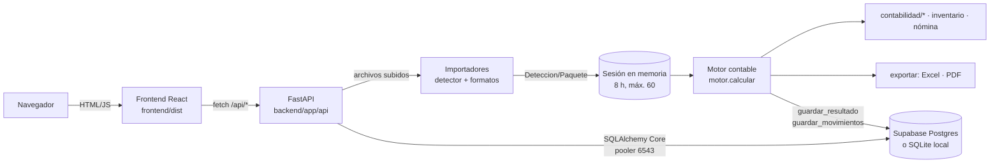

# Informe del estado actual · Carlos Cruz — Contabilidad que cuadra

**Fecha del corte:** 6 de octubre de 2026, noche (hora de Colombia).
**Cómo se hizo:** solo lectura del código, de la base real (sesión `READ ONLY` de Postgres) y de los archivos. Los flujos que escriben datos se ejecutaron **únicamente en una copia aislada** (servidor en el puerto 8001 con una base SQLite desechable del directorio temporal, nunca Supabase). Los cálculos con los archivos reales de FANANT se hicieron en memoria, sin guardar nada.
**Quién debe poder leerlo:** alguien que no ve el código. Por eso se dan rutas, nombres de funciones y endpoints concretos.

> **Sobre el incidente del 6 de octubre:** el usuario aclaró que el archivo de las 18:12 lo subió él. No se investiga como ataque. El defecto que reveló es real y está documentado como hallazgo **H01**, con la corrección propuesta y **sin aplicar**.

---

## 4.1 Resumen ejecutivo

**¿Hoy se puede subir un Excel y obtener los seis entregables sin digitar nada? → PARCIAL.**
Con un cliente ya creado, subir el Excel produce sin intervención el balance de prueba, el balance definitivo, los estados financieros y, si el archivo trae kardex, los saldos de inventario. Las cifras de control de `CONTABILIDAD.xls` dan exactas (8.500.777 = 8.500.777; caja 7.144.505; resultado −653.215). Pero:
- el cliente hay que crearlo antes, **a mano**: la app no lo crea con los datos del Excel;
- el **libro diario** existe solo como lista en pantalla, sin informe ni descarga;
- el **libro mayor y balances** oficial no existe; hay un libro mayor detallado solo en Excel;
- los **PDF con texto se leen pero no entran** a la contabilidad.

**Los 5 problemas más graves**
1. **H01 · Bloqueante.** Un cálculo nuevo reemplaza un periodo **cerrado** sin avisar, aunque venga con 0 cuentas, y no guarda copia del anterior. Se reprodujo en la copia aislada.
2. **H02 · Bloqueante.** Los datos de FANANT enero 2025 están en $ 0. Lo único que sobrevive es el cierre: 13 saldos.
3. **H03 · Alta.** No se puede subir el Excel de un cliente que no existe: hay que crear la ficha a mano. Además el backend asume por defecto la identidad de FANANT.
4. **H05/H06 · Alta.** Libro diario y libro mayor incompletos frente a lo que pidió el cliente.
5. **H04 · Alta.** El PDF con texto se lee pero el detector lo marca «desconocido»: no aporta ninguna cuenta.

**Datos reales de FANANT hoy:** 1 cliente y 1 periodo (enero 2025, estado «cerrado», 0 cuentas, todas las cifras en $ 0), 0 movimientos guardados, 1 resultado guardado vacío y **1 cierre intacto con 13 saldos** (caja 37.144.505, capital 37.800.000, pérdida 2.857.975,72). Se recupera volviendo a calcular con `docs/fuentes/CONTABILIDAD.xls` y `NOMINA__enero__2025.xlsx` (ver §4.10).

---

## 4.2 Arquitectura y cómo se ejecuta

### Stack (versiones instaladas en `.venv` y `frontend/node_modules`)
| Capa | Tecnología |
|---|---|
| Backend | Python 3.12.10 · FastAPI 0.141.1 · Uvicorn 0.54.0 · Pydantic 2.13.5 · SQLAlchemy 2.1.1 (Core, sin ORM) · psycopg 3.3.6 |
| Lectura de archivos | openpyxl 3.1.5 (xlsx) · xlrd ≥ 2.0.1 (xls) · pypdf ≥ 5.0 (PDF con texto) · rapidfuzz ≥ 3.9 (mapeo de nombres de cuenta al PUC) |
| Exportación | openpyxl (Excel con fórmulas) · ReportLab 5.0.1 (PDF) |
| Pruebas | pytest ≥ 8 · httpx |
| Base de datos | **Supabase · PostgreSQL 17.11**, vía *pooler* en modo transacción (puerto 6543). Alternativa local: SQLite, con el mismo código |
| Frontend | React 18.3.1 · React Router 6.30.6 · Vite 5.4.21 · TypeScript 5.6.3 · Tailwind CSS 4.3.3 · GSAP 3.15 (Flip, ScrollTrigger) · lucide-react 1.52 · fuentes Geist autoalojadas (@fontsource) |
| Herramientas | Node 20.18 · Playwright 1.63 con Microsoft Edge (capturas y pruebas visuales) |

### Árbol comentado (lo importante)
```
sistema-contable-fanant/
├─ iniciar.bat              ← arranque local: venv, dependencias, recompila la interfaz si src/ cambió, siembra datos, abre :8000
├─ render.yaml · Dockerfile ← despliegue del backend (Render). No desplegado aún
├─ backend/
│  ├─ app/
│  │  ├─ main.py            ← FastAPI; registra routers; sirve frontend/dist (index.html sin caché, /assets inmutable)
│  │  ├─ config.py          ← lee backend/.env; elige Supabase o SQLite (ALMACENAMIENTO); rutas CC_*
│  │  ├─ db.py              ← motor SQLAlchemy (pooler, prepare_threshold=None), conexion() y lectura()
│  │  ├─ esquema.py         ← las 12 tablas; tipos Dinero (2 dec.) y Tasa (6 dec.) con ROUND_HALF_UP
│  │  ├─ exactitud.py       ← a_json(): Decimal → texto; nunca floats hacia el navegador
│  │  ├─ motor.py           ← orquesta el cálculo completo: calcular(), preparar_paquete(), items_mapeo()
│  │  ├─ api/               ← endpoints: clientes.py · analisis.py · trabajo.py · sistema.py
│  │  ├─ importadores/      ← detector.py + un módulo por formato (plantilla, cuenta_t, hoja_trabajo, aportes, nomina, estados_existentes, pdf_lector, clientes_excel)
│  │  ├─ contabilidad/      ← puc.py (catálogo, naturaleza, Mapeador) · mayor.py · ajustes.py · cierre.py · estados.py · validaciones.py · reportes.py
│  │  ├─ inventario/kardex.py · nomina/ (calculo, asiento, auditoria, parametros)
│  │  ├─ exportar/          ← excel.py (libro completo) · pdf.py · plantilla.py (plantilla y casos de ejemplo) · casos.py
│  │  ├─ inteligencia/sugerencias.py ← alertas de cartera (atraso, descuadre, pérdidas, huecos…)
│  │  └─ repositorio/       ← acceso a datos: clientes, periodos, alias, parametros, sesiones (en memoria)
│  ├─ tests/                ← 111 pruebas (todas contra SQLite temporal)
│  ├─ sembrar.py · comprobar.py · mantener_vivo.py
├─ data/                    ← puc.json (catálogo) · alias.json · parametros_legales.json · empresa_fanant.json (empresa por defecto)
├─ docs/fuentes/            ← archivos reales de FANANT: CONTABILIDAD.xls, NOMINA__enero__2025.xlsx, ESTADOS_FINANCIEROS.xlsx + Word
├─ docs/diseno/             ← especificación, informes de las 9 fases del rediseño, capturas, CONTRASTES, MARCA, PROPUESTAS
├─ supabase/migraciones/    ← 001_esquema.sql · 002_seguridad.sql (RLS)
├─ empaquetar/              ← lanzador.py + carloscruz.spec (PyInstaller) → salida/CarlosCruz/CarlosCruz.exe
└─ frontend/
   ├─ src/App.tsx           ← rutas, transiciones de página, preloader
   ├─ src/api.ts            ← único punto de llamadas HTTP (VITE_API como base)
   ├─ src/formato.ts        ← importes como texto: pesos(), sumar(), restar(), razon(), cmp() — sin floats
   ├─ src/paginas/          ← Tablero, Clientes, ClienteFicha, ClienteEditor, Trabajo (+ Inicio, VistaPrevia, Resultados), Parametros, Diseno
   ├─ src/componentes/      ← Marco (barra lateral/superior), Reporte, ResultadoGuardado, PanelMetricas, Preloader, Buscador…
   ├─ src/ui/               ← componentes del sistema de diseño (Expediente, Cifra, Interruptor, TablaContable…)
   ├─ src/styles/tokens.css ← única fuente de colores, sombras, radios y fuentes
   └─ scripts/              ← lint-diseno, capturas, comparar, flujo-trabajo, necesita-build
```

### Arranque local
- `iniciar.bat` crea `.venv` si falta, instala `backend/requirements.txt`, copia `.env.example` → `backend/.env` si no existe, **recompila la interfaz si algún archivo de `frontend/src` es más nuevo que `frontend/dist/index.html`** (`frontend/scripts/necesita-build.mjs`), ejecuta `backend/sembrar.py` y levanta `uvicorn app.main:app --app-dir backend --port 8000`.
- **Un solo puerto (8000):** FastAPI sirve la API en `/api/*` y la interfaz compilada (`frontend/dist`) en todo lo demás (`main.py · spa`).
- En desarrollo, `npm run dev` (Vite, puerto 5173) reenvía `/api` a :8000.

### Variables de entorno (solo nombres)
- **Backend:** `DATABASE_URL`, `ALMACENAMIENTO` (`supabase` | `local`), `SUPABASE_URL`, `SUPABASE_ANON_KEY`, `SUPABASE_SERVICE_KEY`, `CLAVE_SESION`, `CORS_ORIGENES`.
- **Rutas (opcionales):** `CC_DATA`, `CC_FUENTES`, `CC_FRONTEND`, `CC_DATOS_APP`, `CC_SQLITE`, `CC_ENV`.
- **Frontend:** `VITE_API` (URL del backend cuando la interfaz va en Vercel).

Las claves de Supabase solo se usan en el backend para mostrar el nombre del proyecto; **ninguna llega al navegador**.

### Ejecutable `.exe`
- Se genera con `empaquetar/construir.bat`: instala PyInstaller, compila la interfaz y empaqueta con `empaquetar/carloscruz.spec`.
- Salida actual: `empaquetar/salida/CarlosCruz/CarlosCruz.exe`, del **6-oct-2026 a las 12:25**. Es **anterior al rediseño completo**: contiene la interfaz vieja.
- El lanzador (`empaquetar/lanzador.py`) guarda los datos en `Documentos\Carlos Cruz\carloscruz.db` (SQLite local) y crea `configuracion.env` con `ALMACENAMIENTO=local`. Para usar Supabase hay que llenar ahí `DATABASE_URL`.

### Despliegue (según `docs/DESPLIEGUE.md` y el repositorio)
| Pieza | Estado |
|---|---|
| Supabase | ✅ Proyecto creado, 12 tablas, RLS activa |
| GitHub | ⬜ No subido. El repositorio local **no tiene commits**; alguien preparó el índice (`git add`) sin confirmar |
| Render (backend) | ⬜ No creado. `render.yaml` listo, plan gratuito |
| Vercel (frontend) | ⬜ No creado. `frontend/vercel.json` listo |
| Mantener Supabase despierto | ⬜ Workflow `.github/workflows/mantener-supabase-vivo.yml` listo; falta el secreto `DATABASE_URL` en GitHub |

> **Riesgo del plan gratuito de Render:** el servicio se duerme tras unos 15 minutos sin uso, y las sesiones de trabajo viven en memoria. Si se duerme entre «subir» y «calcular», hay que subir el archivo de nuevo.

### Diagrama


---

## 4.3 Backend

### Endpoints
| Método | Ruta | Recibe | Devuelve | Tablas | Pantalla que lo usa |
|---|---|---|---|---|---|
| GET | `/api/salud` | — | estado, versión, almacenamiento (modo, conectado, motor, proyecto, error), sesiones abiertas | — | Marco (sincronización), Parámetros › Sistema |
| GET | `/api/puc` | — | catálogo PUC (código, nombre) | — | Trabajar · 03 Mapeo |
| GET | `/api/parametros` | — | parámetros legales por año | parametros_legales | Tablero, Parámetros |
| PUT | `/api/parametros/{anio}` | smmlv, aux_transporte, jornada_tramos | año guardado | parametros_legales (escribe) | Parámetros |
| GET | `/api/clientes` | q, estado, etiqueta, orden, descendente, pagina, por_pagina | página de clientes | clientes | Clientes, Tablero, Trabajar · 01 |
| GET | `/api/clientes/resumen` | — | conteos y estado del trabajo | clientes, periodos | **ninguna** |
| GET | `/api/clientes/buscar` | q, limite | sugerencias | clientes | **ninguna** (la paleta usa `/api/buscar`) |
| GET | `/api/clientes/plantilla` | — | CSV de ejemplo del directorio | — | Clientes (importar) |
| POST | `/api/clientes/importar` | archivo, actualizar_existentes, solo_revisar | informe de importación | clientes (escribe) | Clientes (importar Excel) |
| POST | `/api/clientes` | ficha | cliente creado (calcula DV) | clientes, socios (escribe) | Editor de cliente |
| GET | `/api/clientes/{id}` | — | ficha + socios | clientes, socios | Ficha, Editor, Trabajar |
| PATCH | `/api/clientes/{id}` | campos | ficha actualizada | clientes, socios (escribe) | Editor |
| DELETE | `/api/clientes/{id}` | `definitivo` | archiva, o elimina con toda su contabilidad | clientes + cascada | Ficha › Datos |
| POST | `/api/clientes/{id}/restaurar` | — | ficha | clientes (escribe) | **ninguna** (no hay botón) |
| GET | `/api/clientes/{id}/alias` | — | alias aprendidos | alias_cuenta | **ninguna** |
| GET | `/api/clientes/{id}/periodos` | limite | periodos + cierres | periodos, cierres | Ficha, Tablero |
| GET | `/api/clientes/{id}/serie` | limite | periodos para gráficas | periodos | Ficha |
| GET | `/api/clientes/{id}/movimientos` | cuenta, pagina, por_pagina | libro diario guardado + sumas | movimientos | Ficha › Libro diario |
| GET | `/api/clientes/{id}/sugerencias` | — | revisión automática | periodos, resultados, cierres | Ficha |
| GET | `/api/periodos/{id}` | — | periodo | periodos | **ninguna** |
| GET | `/api/periodos/{id}/resultado` | — | resultado completo guardado | resultados | Ficha (Estados, Inventario, Nómina) |
| DELETE | `/api/periodos/{id}` | — | elimina (rechaza cerrados) | periodos + cascada | Ficha › Periodos |
| POST | `/api/periodos/{id}/reabrir` | — | estado → calculado, **borra el cierre** | periodos, cierres | Ficha › Periodos |
| GET | `/api/periodos/{id}/excel` · `/pdf` · `/saldos` | — | descargas del periodo guardado | resultados | Ficha › Estados financieros |
| GET | `/api/tablero` | — | conteos, pendientes de la cartera, serie mensual | clientes, periodos, resultados | Tablero |
| GET | `/api/buscar` | q, limite | resultados de búsqueda | clientes | Paleta ⌘K |
| POST | `/api/importar` | archivos[], cliente_id | sesión: hojas detectadas, mapeo, empresa, periodo sugerido | lee clientes, alias_cuenta | Trabajar · 02 |
| POST | `/api/importar/ejemplo` | cliente_id | igual, con los 3 archivos reales de FANANT | — | Trabajar · 02 («Cargar archivos de FANANT») |
| GET | `/api/casos` | — | los 3 casos de ejemplo | — | Trabajar · 02 |
| POST | `/api/importar/demo` | cliente_id, caso | igual, con un caso de ejemplo | — | Trabajar · 02 («Cargar») |
| POST | `/api/calcular` | sesion_id, cliente_id, mapeo, incluir, decisiones, config, empresa, recordar_alias | resultado completo; `guardado` true/false | **escribe** alias_cuenta, periodos, resultados, movimientos; lee cierres | Trabajar · 03 → 04 |
| GET | `/api/exportar/{sid}/excel` · `/pdf` · `/saldos` | — | descargas del cálculo en memoria | — | Trabajar · 04–07 |
| POST | `/api/cierre/{sid}` | — | marca cerrado y guarda saldos de apertura | periodos, cierres (escribe) | Trabajar › «Guardar cierre definitivo» |
| GET | `/api/plantilla` · `/api/plantilla-demo?caso=` | — | plantilla vacía / de ejemplo | — | Trabajar · 02 |
| GET | `/{ruta}` | — | la interfaz (SPA) | — | — |

### Módulos del motor contable
| Módulo | Archivo · funciones | Qué hace | Qué no hace |
|---|---|---|---|
| Lectura | `importadores/lector.py · leer_archivo, leer_xlsx, leer_xls, leer_csv`; `pdf_lector.py · leer_pdf` | Convierte cada archivo en «hojas» de celdas. El PDF se reduce a filas «código · nombre · importes» | No hace OCR. Un PDF escaneado se rechaza con mensaje claro |
| Detección | `importadores/detector.py · detectar_archivos, detectar_hoja, _marcar_duplicados` | Prueba en orden: plantilla oficial, estados existentes, nómina, aportes, hoja de trabajo, cuenta T. Marca duplicados (p. ej. cuenta T = hoja de trabajo) | **No tiene rama para la hoja que sale de un PDF**: queda «desconocido» (H04) |
| Mapeo PUC | `contabilidad/puc.py · Mapeador`; `repositorio/alias.py`; `data/alias.json` | Lleva nombres libres («GTO SALARIOS») a códigos PUC por alias exactos, aprendidos por NIT y por similitud (rapidfuzz). Estados: exacto, por confirmar, sin mapear | — |
| Paquete | `motor.preparar_paquete` | Junta las hojas incluidas y aplica el mapeo | — |
| Mayor | `contabilidad/mayor.py · construir_mayor, CuentaMayor` | Saldo inicial, movimientos D/C y saldo según la naturaleza | — |
| Balance de prueba | `mayor.py · reporte_balance_prueba` | Saldo inicial, movimiento y saldo final (D/C) por cuenta, con totales por clase y sumas iguales | — |
| Validaciones | `contabilidad/validaciones.py` | Partida doble, sumas iguales, fuera de periodo, sin mapear, naturaleza contraria, capital vs. estatutos, causal de disolución, gastos personales, honorarios sin retención, representante en nómina… | — |
| Ajustes | `contabilidad/ajustes.py` | Propone: costo de ventas por kardex, diferencias de conteo físico, conciliación 1435, depreciación, causación y provisiones de nómina, reclasificaciones (IVA, gastos personales, aportes), renta, ajustes manuales. Cada uno se acepta o rechaza | — |
| Hoja de trabajo | `contabilidad/cierre.py · hoja_trabajo` | 12 columnas: prueba, ajustes, ajustado, resultados y balance | — |
| Cierre y definitivo | `cierre.py · asiento_cierre, mayor_despues_cierre, reporte_balance_definitivo` | Asiento de cierre de resultados a 3605/3610, balance definitivo y saldos para el periodo siguiente | — |
| Estados financieros | `contabilidad/estados.py · situacion_financiera, estado_resultados, cambios_patrimonio, flujo_efectivo, indicadores, notas` | Los cuatro estados, indicadores y notas automáticas | El flujo es por método indirecto simplificado |
| Inventario | `inventario/kardex.py · calcular, comparar_fisico, vencimientos` | Kardex promedio ponderado o PEPS, costo de ventas, saldo valorizado, conteo físico, vencimientos | Solo si el archivo trae la hoja de movimientos de inventario |
| Nómina | `nomina/calculo.py · liquidar`, `nomina/asiento.py`, `nomina/auditoria.py` | Liquida devengados, deducciones, prestaciones y aportes (con o sin exoneración 114-1); genera los asientos; audita la nómina del Excel celda por celda | Solo meses dentro del periodo |
| Libro mayor | `mayor.py · reporte_libro_mayor` | Por cuenta: saldo inicial, cada movimiento (fecha, comprobante, descripción, D/C) y saldo corrido | No agrupa por nivel PUC ni existe el formato oficial «mayor y balances» (H06) |
| Libro diario | `api/trabajo.py · _movs_json` + `repositorio/periodos.py · guardar_movimientos` | Guarda en `movimientos` cada línea del mayor ajustado | **No hay informe ni exportación** del libro diario (H05) |
| Cuentas T | `motor._cuentas_t` | Débitos y créditos por cuenta, antes de ajustes | — |
| Exportación | `exportar/excel.py · libro_completo, saldos_xlsx`; `exportar/pdf.py · generar` | Excel con Portada, Estados financieros, Balances, Hoja de trabajo, Libro mayor, Inventario, Nómina, Ajustes, Notas, EF formato contador, Auditoría, Alertas, Saldos. PDF de unas 10 páginas: 4 estados, indicadores, balance de prueba, hoja de trabajo, balance definitivo e inventario, con firmas | PDF sin libro diario ni libro mayor; Excel sin libro diario |

### `Decimal` y redondeos
- Todo importe es `Decimal`. Se redondea con `ROUND_HALF_UP` en tres sitios:
  - al guardar en la base (`esquema.py · Dinero` a 2 decimales y `Tasa` a 6);
  - en la liquidación de nómina, kardex, ajustes y estados (`utils/numeros.py · redondear`);
  - en porcentajes de presentación (`sugerencias.py`).
- `exactitud.py · a_json` convierte cada `Decimal` a texto antes de responder. Hay pruebas que verifican que **no sale ni un float** al navegador.
- El frontend suma, resta y divide texto con BigInt (`formato.ts`). `Number` solo se usa para dibujar gráficas.

### Catálogo PUC y parámetros legales
- `data/puc.json`: PUC de comerciantes (Decreto 2650/1993) con clases, grupos, cuentas y subcuentas de uso frecuente (≈ 294 entradas), más las excepciones de naturaleza (1592, 1299… crédito; 4175, 3610… débito). Las cuentas no listadas se aceptan si existe su padre.
- Parámetros legales 2025 y 2026 (SMMLV, auxilio, aportes, prestaciones, ARL, FSP, jornada por tramos) en la tabla `parametros_legales`, sembrados desde `data/parametros_legales.json`. Se editan en la pantalla Parámetros.

### Manejo de errores
- Los errores del servidor llegan en español en `detail`; la interfaz los muestra en una hoja con borde rojo, el mensaje, un «Detalle técnico» plegable y el botón «Reintentar».
- Un fallo de cálculo da HTTP 500 «No se pudo calcular: …» sin tumbar el servidor.
- Si el cálculo sale bien pero no se guarda, responde `guardado: false` con el motivo y la interfaz lo avisa.
- Sin conexión a la base, `/api/salud` lo informa y el Marco muestra «Sin conexión». **No hay modo degradado**: entre las 18:29 y las 18:36 del 6-oct, el log muestra fallos de DNS hacia el pooler de Supabase y en esos minutos nada funcionó.

---

## 4.4 Base de datos (Supabase)

Lectura hecha con una sesión `READ ONLY` confirmada (`transaction_read_only = on`). PostgreSQL 17.11.

| Tabla | Filas hoy | Columnas clave | Relación |
|---|---|---|---|
| clientes | 1 | id (uuid), nit, dv, razon_social, sigla, estado (activo/inactivo/archivado), periodicidad, honorarios_mes, capital_suscrito, rep_legal, contador, contador_tp, etiquetas | — |
| socios | 4 | cliente_id, nombre, cedula, comprometido, pagado | → clientes |
| periodos | 1 | id, cliente_id, desde, hasta, estado, total_activo/pasivo/patrimonio/ingresos/gastos, utilidad, descuadre, **cuadra** (bool), cuentas, calculado_en, cerrado_en | → clientes |
| resultados | 1 | periodo_id, cliente_id, payload (JSON completo del cálculo), peticion (JSON), creado | → periodos |
| movimientos | **0** | periodo_id, cliente_id, fecha, cuenta, nombre_cuenta, debito, credito, comprobante, tipo, tercero_id, tercero_nombre, descripcion, origen, base_retencion | → periodos |
| cierres | 1 | cliente_id, periodo_id, fecha_corte, saldos (JSON), cuentas | → clientes, periodos |
| alias_cuenta | 44 | NIT del cliente, nombre normalizado, código PUC | → clientes |
| parametros_legales | 2 | anio, valores (JSON), fuente, actualizado | — |
| empleados | 0 | — | **no se usa** |
| importaciones | 0 | archivo, hoja, formato, sha256, bytes, filas, alertas | **no se usa** (nada escribe) |
| bitacora | 0 | cliente_id, accion, detalle | **no se usa** |
| sesiones | 0 | — | **no se usa**: las sesiones viven en memoria |

Al eliminar un cliente se borra en cascada toda su contabilidad (verificado por la prueba `test_eliminar_el_cliente_arrastra_su_contabilidad`).

### Estados de un periodo
`borrador` (se crea con `repositorio/periodos.py · asegurar`) → `calculado` (`guardar_resultado`) → `cerrado` (`cerrar`, al pulsar «Guardar cierre definitivo»).
`reabrir` lo devuelve a `calculado` **y borra su cierre**. `eliminar` rechaza un periodo cerrado.

### Cómo se guarda un cálculo (`repositorio/periodos.py · guardar_resultado`)
1. Lee del resultado `empresa.periodo_desde` y `periodo_hasta`; si faltan, error.
2. `asegurar(cliente, desde, hasta)`: busca el periodo con esas fechas o lo crea en `borrador`.
3. Extrae los indicadores del `resumen` (totales, utilidad, descuadre, `cuadra`, cuentas).
4. `UPDATE periodos`: escribe los indicadores; el estado queda `cerrado` si ya lo era, si no `calculado`; `calculado_en = ahora`.
5. **`DELETE` del resultado anterior** de ese periodo e `INSERT` del nuevo (payload + petición). No guarda copia.
6. Después, `api/trabajo.py · calcular` llama a `guardar_movimientos`, que hace **`DELETE` de todos los movimientos** del periodo e inserta los nuevos.

**Lo que no hace:**
- no revisa si el periodo está cerrado;
- no revisa si el cálculo trae cuentas o movimientos;
- no toca el cierre: un periodo cerrado puede quedar con resultado nuevo y cierre viejo;
- no deja rastro (las tablas `importaciones` y `bitacora` están vacías).

### Seguridad (RLS y claves)
- **RLS activada en las 12 tablas, con 0 políticas y sin privilegios para `anon` ni `authenticated`.** Es decir, con la clave pública nadie puede leer ni escribir nada.
- El backend se conecta como `postgres` por el pooler; ese rol salta RLS, que es lo esperado en un backend de servidor.
- El navegador **nunca** habla con Supabase: solo llama a `/api/*` del backend. Ninguna clave llega al frontend (verificado: `src/` no contiene claves, solo `VITE_API`).

### Configuración de conexión (`backend/app/db.py`)
| Ajuste | Por qué |
|---|---|
| Pooler en modo transacción, puerto 6543 | Es el que acepta Supabase gratuito con muchas conexiones cortas |
| `prepare_threshold=None` | Sin esto, psycopg3 registra sentencias preparadas que chocan entre conexiones del pooler (error `DuplicatePreparedStatement` al calcular). Lo protege `test_conexion.py` |
| `pool_pre_ping=False`, `pool_recycle=240` | El ping agrega un viaje de ida y vuelta; el reciclaje a los 4 minutos evita conexiones que el pooler ya cerró |
| Lecturas en `AUTOCOMMIT` (`lectura()`) | Una consulta por viaje |

---

## 4.5 Frontend

### Rutas y pantallas
| Ruta | Muestra | Endpoints | Acciones |
|---|---|---|---|
| `/` Tablero | Resultado del último mes de la cartera, ecuación contable del corte más reciente, tira de 12 meses, nómina vigente, cola de pendientes y carrusel de clientes recientes | tablero, parametros, clientes, clientes/{id}/periodos | Ir a ficha, estados, parámetros |
| `/clientes` | Directorio en carpetas o tabla, filtro por estado, búsqueda y orden | clientes, clientes/importar, clientes/plantilla | Crear, importar Excel del directorio |
| `/clientes/nuevo`, `/clientes/:id/editar` | Formulario de ficha y socios | clientes (POST/PATCH/GET) | Guardar |
| `/clientes/:id` (`?vista=`) | Cabecera, 8 pestañas: Resumen, Periodos, Estados financieros, Inventario, Nómina, Socios, Libro diario, Datos | clientes/{id}, periodos, serie, sugerencias, movimientos, periodos/{id}/resultado, excel/pdf/saldos, reabrir, eliminar | Reabrir o eliminar periodo, archivar o eliminar cliente, descargar |
| `/trabajo` (`?cliente=`) | Paso a paso 01–07: elegir cliente, subir, mapear, balance de prueba, ajustes, definitivo, estados | importar, demo, ejemplo, casos, puc, calcular, exportar/*, cierre | Subir, calcular, aceptar ajustes, guardar cierre, descargar, imprimir |
| `/parametros` | Valores por año, formulario y subsección Sistema | parametros, salud | Guardar año |
| `/diseno` | Catálogo interno del sistema de diseño | — | — |
| `/inicio` | Redirige a `/trabajo` | — | — |

### Sistema de diseño (resumen; detalle en `docs/diseno/ANTES_Y_DESPUES.md`)
- Tokens en `src/styles/tokens.css`, componentes en `src/ui/` y animación central en `src/animacion/` (GSAP).
- `npm run lint:diseno` impide colores fuera de los tokens, emojis, degradados y cifras abreviadas. Hoy da **0 infracciones**.
- Preloader «La cuenta T»: una vez por sesión, se puede saltar, tope de 4 s.
- Lighthouse de accesibilidad y buenas prácticas: 100/100 en las pantallas principales.

### Botones o enlaces con problemas
- **No hay forma de restaurar un cliente archivado** desde la interfaz, aunque el endpoint existe (H09).
- **«Cargar archivos de FANANT»** (Trabajar · 02) está disponible para **cualquier** cliente: carga la contabilidad real de FANANT en el expediente elegido (H10).
- En la ficha › Estados financieros, «Excel completo» es un botón azul sólido junto al «Nuevo periodo» azul de la barra (dos azules; detalle de diseño, H16).
- El catálogo `/diseno` tiene botones de muestra sin acción. Es intencional: es una página interna.

### Textos escritos a mano que deberían venir de los datos
| Texto | Dónde | Comentario |
|---|---|---|
| «Carlos Cruz — Contador Público», «T.P. 103028-T» | `componentes/Marca.tsx` | Son los datos del contador dueño de la app. Aceptable, pero si hubiera otro usuario deberían venir de una configuración |
| «Guacarí, Valle del Cauca» | Esquina del preloader (`componentes/Preloader.tsx`) | Lo pedía el spec; es el municipio de FANANT, no del contador |
| Empresa por defecto FANANT | Backend, `data/empresa_fanant.json` vía `modelos.empresa_por_defecto` | Cuando no hay cliente, el cálculo asume NIT, razón social y capital de FANANT (H03) |
| Archivos de ejemplo de FANANT | `api/trabajo.py · ARCHIVOS_EJEMPLO` | Ver H10 |

---

## 4.6 Flujos de punta a punta

Leyenda: **[E]** verificado en ejecución en la copia aislada · **[C]** solo leyendo el código.

### 1. Subir un Excel de un cliente que ya existe — [E]
1. Trabajar › 01: se elige el cliente (`GET /api/clientes`).
2. 02 Subir: `POST /api/importar?cliente_id=…` → `trabajo._importar`:
   - `_empresa_base` lee la ficha (`clientes`);
   - el `Mapeador` carga los alias aprendidos (`alias_cuenta`);
   - `detectar_archivos` reconoce las hojas;
   - `_periodo_sugerido` elige las fechas en este orden: hoja EMPRESA de la plantilla, mes de la nómina, último periodo del cliente;
   - se crea una sesión **en memoria**.
3. 03 Mapeo: la interfaz muestra hojas y cuentas con su semáforo; el usuario confirma.
4. «Calcular todo»: `POST /api/calcular` → `motor.preparar_paquete` → si no hay saldos iniciales, `repositorio/periodos.saldos_previos` los toma del cierre anterior → `motor.calcular` → `guardar_resultado` + `guardar_movimientos`.
5. 04–07: balance de prueba, ajustes, definitivo y estados (pestañas del mismo resultado).

**Resultado con `CONTABILIDAD.xls` + `NOMINA__enero__2025.xlsx`:**
- periodo sugerido: enero 2025 (por la nómina «#002»);
- 7 hojas detectadas; 28 nombres de cuenta, 28 exactos;
- guardado ✅, 20 movimientos y 20 cuentas;
- activo 37.144.505, pasivo 578.980,72, patrimonio 36.565.524,28, ingresos 22.641, utilidad −1.234.475,72;
- balance de prueba ✅ y estado de situación ✅ cuadran;
- 3 ajustes propuestos; solo «provisiones de nómina» aceptado por defecto. La causación de nómina no se acepta sola porque ya hay gastos de personal (5105) en el diario, para no duplicar.

### 2. Subir un Excel de un cliente que **no** existe — [E] (API) + [C] (interfaz)
- **Sigue pasando.** La pantalla Trabajar (`paginas/Trabajo.tsx · ElegirCliente`) **exige elegir un cliente antes de subir**. Si no existe, el único camino es «Crear el cliente» y llenar la ficha a mano. Nada lee los datos del Excel para crearla.
- Por API, `POST /api/importar` sin cliente funciona, pero **asume la empresa por defecto: FARMACIA NATURISTA ANTARES S.A.S., NIT [NIT]-9** (`modelos.empresa_por_defecto`). El cálculo responde `guardado: false`, y `POST /api/cierre/{sid}` responde 400 «hay que trabajar sobre un cliente del directorio».
- **Punto exacto del fallo:** `api/trabajo.py · _empresa_base` (sin cliente → FANANT) y `calcular` (sin `cliente_id` → no guarda).
- Solo la hoja EMPRESA de la plantilla oficial trae razón social, NIT y periodo; los demás formatos no traen identidad de empresa.

### 3. Subir para un periodo que ya existe, y para uno cerrado — [E]
- **Periodo existente (calculado):** se reemplaza el resultado y los movimientos (prueba `test_recalcular_reemplaza_y_no_duplica`). Es el comportamiento buscado.
- **Periodo cerrado (reproducción del incidente en la copia):**
  - enero «cerrado» con activo 37.144.505 y 20 cuentas;
  - se recalcula con **todas las hojas desmarcadas**;
  - respuesta 200 y `guardado: true`;
  - enero queda **cerrado, activo 0, 0 cuentas**, y el cierre viejo de 11 cuentas sigue ahí, desalineado.
  - Es exactamente lo ocurrido con FANANT el 6 de octubre (H01).

### 4. Archivo sin cuentas o inválido — [E]
| Archivo | Qué pasa |
|---|---|
| `.docx` | 400 «formato no admitido. Se aceptan .xlsx, .xlsm, .xls, .csv, .txt, .pdf» ✅ |
| CSV con texto cualquiera | 200: se crea la sesión; las hojas quedan «desconocido» |
| Excel vacío | 200: hoja «Hoja vacía». **Se puede calcular y se guarda** un periodo (marzo) que solo tiene los saldos arrastrados del cierre ❌ |
| PDF con texto de un balance | Se lee, pero el detector lo deja «desconocido»: no entra nada ❌ (H04) |
| PDF escaneado | Hoja «desconocido» con el mensaje «parece un PDF escaneado… pida el archivo en Excel» ✅ |

### 5. Ajustes → definitivo → cierre → apertura del mes siguiente — [E]
- Los ajustes se aceptan o rechazan en la pestaña Ajustes y se recalcula (`decisiones`).
- «Guardar cierre definitivo» → `POST /api/cierre/{sid}` → `repositorio/periodos.cerrar`: enero queda cerrado con 11 saldos.
- Febrero, subido sin saldos iniciales (solo la hoja cuenta T), tomó los saldos del cierre: alerta «Saldos iniciales tomados del cierre guardado al 2025-01-31»; caja inicial 37.144.505 → final 44.289.010 ✅.

### 6. Descargar cada entregable — [E]
| Descarga | Resultado |
|---|---|
| `exportar/{sid}/excel` | 200 · 42 KB · hojas: Portada, Estados financieros, Balances, Hoja de trabajo, Libro mayor, Nómina, Ajustes, Notas, EF formato contador, Auditoría, Alertas, Saldos siguiente periodo |
| `exportar/{sid}/pdf` | 200 · 24 KB · ≈ 10 páginas |
| `exportar/{sid}/saldos` | 200 · hoja SALDOS_INICIALES |
| `periodos/{id}/excel` | 200 · las mismas hojas salvo «EF formato contador» (necesita el mayor en memoria) |
| `periodos/{id}/pdf` · `/saldos` | 200 |

**No existe descarga del libro diario**, ni en Excel ni en PDF.

### 7. Crear, editar y eliminar un cliente — [E]
Crear (DV calculado) ✅ · editar honorarios ✅ · archivar ✅ · restaurar por API ✅ (**sin botón en la interfaz**) · eliminar definitivo ✅ (luego 404). Además lo cubren 21 pruebas.

---

## 4.7 Matriz de cumplimiento de requisitos

Cifras de control con `docs/fuentes/CONTABILIDAD.xls`, calculado en memoria con el mapeo propuesto por el sistema.

| Entregable | ¿Existe? | Backend (archivo · función) | Endpoint | Pantalla | Excel | PDF | Verificado con | Cifras de control | Estado |
|---|---|---|---|---|---|---|---|---|---|
| Libro diario | Parcial | `trabajo._movs_json` + `periodos.guardar_movimientos` | `GET /api/clientes/{id}/movimientos` | Ficha › Libro diario | ❌ | ❌ | Copia aislada, cuenta T de CONTABILIDAD.xls | 29 movimientos · D 8.500.777 = C 8.500.777 · «cuadra» | ⚠️ Mezcla todos los periodos (sin selector), sin columna de comprobante, sin totales por comprobante; fecha vacía cuando la fuente no la trae; con la hoja de trabajo los 29 movimientos se agregan en 6 |
| Libro mayor / mayor y balances / cuentas T | Mayor y cuentas T sí; mayor y balances no | `mayor.reporte_libro_mayor`; `motor._cuentas_t` | Incluido en `/api/calcular` y `/periodos/{id}/resultado` | Trabajar › Libro mayor y cuentas T; Ficha › Estados › Libro mayor | ✅ (hoja «Libro mayor») | ❌ | CONTABILIDAD.xls | Caja: saldo inicial + movimientos D 7.822.641 / C 678.136 | ⚠️ Mayor por cuenta con saldo corrido. No agrupa por nivel PUC; no existe el «Libro mayor y balances» oficial; no va en el PDF |
| Balance de prueba | ✅ | `mayor.reporte_balance_prueba` | `/api/calcular` | Trabajar · 04; Ficha › Estados › Balances | ✅ | ✅ | CONTABILIDAD.xls | Movimientos **8.500.777 = 8.500.777** ✅; finales 37.822.641 = 37.822.641 | ✅ |
| Balance definitivo (ajustes y cierre) | ✅ | `cierre.hoja_trabajo`, `asiento_cierre`, `reporte_balance_definitivo` | `/api/calcular` | Trabajar · 05–06 | ✅ | ✅ | CONTABILIDAD.xls + nómina; caso «completo» | Hoja de trabajo y ajustado cuadran | ✅ |
| Estado de situación financiera | ✅ | `estados.situacion_financiera` | `/api/calcular` | Trabajar · 07 (documento carta) | ✅ | ✅ | CONTABILIDAD.xls | Solo cuenta T: activo 7.144.505 · con hoja de trabajo: 37.144.505 · cuadra | ⚠️ Pasivo −2.280 porque el IVA con saldo débito no se reclasifica por defecto (el ajuste se propone, H22) |
| Estado de resultados | ✅ | `estados.estado_resultados` | `/api/calcular` | Trabajar · 07 | ✅ | ✅ | CONTABILIDAD.xls | Resultado **−653.215** ✅; ingresos 22.641 | ✅ |
| Cambios en el patrimonio | ✅ | `estados.cambios_patrimonio` | `/api/calcular` | Trabajar · 07 | ✅ | ✅ | Caso «completo» | — | ✅ |
| Flujo de efectivo | ✅ | `estados.flujo_efectivo` | `/api/calcular` | Trabajar · 07 | ✅ | ✅ | Caso «completo» | Cuadra | ✅ Método indirecto simplificado |
| Notas e indicadores | ✅ | `estados.notas`, `estados.indicadores` | `/api/calcular` | Trabajar · 07; Ficha › Resumen | ✅ | Indicadores sí; notas no | Caso «completo» | Razón corriente 6,34 · margen 24,2 % (completo) | ✅ |
| Saldos de inventario (kardex, costo de ventas, conciliación 1435, vencimientos) | ✅ | `inventario/kardex.py`; `motor._reportes_inventario`; `ajustes.ajuste_costo_ventas`, `ajuste_conciliacion_inventario` | `/api/calcular` | Trabajar › Inventarios; Ficha › Inventario | ✅ (kardex por producto) | ✅ (saldos) | Caso «completo» (18 movimientos de inventario) y 3 pruebas (`test_6_kardex_promedio`, `_peps`, `test_inventario_negativo`) | Inventario final 4.728.088,88 (completo) | ✅ No verificado con archivos reales: los de FANANT no traen kardex |
| Nómina y su asiento | ✅ | `nomina/calculo.liquidar`, `nomina/asiento`, `nomina/auditoria`; ajustes `nomina_causacion`, `nomina_provisiones` | `/api/calcular` | Trabajar › Nómina; Ficha › Nómina | ✅ | ❌ | NOMINA__enero__2025.xlsx (hoja #002) | Pruebas `test_5_nomina_002`, `test_nomina_sin_exoneracion` | ✅ (la causación no se acepta sola si ya hay 5105) |

---

## 4.8 Formatos de entrada

| Formato | ¿Se detecta solo? | Qué extrae | ¿Detecta empresa y periodo? | Probado con | Resultado |
|---|---|---|---|---|---|
| Plantilla oficial (EMPRESA, SALDOS INICIALES, MOVIMIENTOS, AJUSTES, INVENTARIO MOVS/FÍSICO, ACTIVOS FIJOS, NÓMINA) | Sí, por el nombre de la hoja | Todo: saldos, movimientos con fecha, comprobante y tercero, ajustes, kardex, activos, empleados | **Sí** (hoja EMPRESA: razón social, NIT, periodo) | Los 3 casos de ejemplo (completo, mediocre, básico) y `test_9_encabezados_desordenados` | ✅ |
| Mayor en cuentas T | Sí | Movimientos por cuenta (sin fechas) | No; avisa si el título menciona otro año | Hoja «cuenta T» de CONTABILIDAD.xls | ✅ 29 movimientos, 8.500.777. Se marca duplicada de la hoja de trabajo y no se incluye por defecto |
| Hoja de trabajo (saldo inicial + movimiento) | Sí | Saldos iniciales y movimiento **agregado por cuenta** | No | «HojaTRABAJO 01--02--03»; la de «ABRIL MAYO Y JUNIO» se excluye por descuadre de $ 598 | ✅ |
| Libro de aportes de socios | Sí | Comprometido y pagado por socio (concilia capital, no genera movimientos) | No | «LIBRO APORTES DE SOCIOS» | ✅ 4 socios, 30.000.000 comprometidos |
| Nómina | Sí | Empleados, devengados y deducciones; audita el archivo celda por celda | **Periodo sí** (mes de la nómina) | NOMINA__enero__2025.xlsx | ✅ #002 incluida; #001 y #003 son ejemplos sin nombres y solo se auditan |
| Estados financieros existentes | Sí | Solo auditoría: compara contra lo calculado y señala fórmulas de cuadre, omisiones y valores digitados | No (avisa NIT en blanco) | ESTADOS_FINANCIEROS.xlsx (Hoja1, Hoja2) | ✅ Hallazgos E1, E2, E3, E4, E19, E20, E21 |
| PDF con texto | Se lee (`pdf_lector.leer_pdf`) | Filas «código · nombre · importes» | No | PDF de balance generado en la prueba | ❌ El detector lo deja «desconocido»: no aporta cuentas (H04). Las pruebas solo cubren la lectura de líneas, no el paso al cálculo |
| PDF escaneado | Se rechaza | — | — | PDF de una página en blanco | ✅ Mensaje «parece un PDF escaneado… pida el archivo en Excel» |
| Directorio de clientes (Excel/CSV) | Sí, en Clientes › Importar | Fichas por NIT (encabezados en cualquier orden) | — | 9 pruebas, incluida una de 1.000 filas | ✅ |

---

## 4.9 Pruebas y calidad

| Archivo | Pruebas | Qué cubre |
|---|---|---|
| `test_periodos_sugerencias.py` | 34 | Crear y recalcular periodos, recuperar el resultado guardado, movimientos que cuadran y se reemplazan, filtro por cuenta, cierre que abre el periodo siguiente, no eliminar periodos cerrados, cascada al borrar cliente, y todas las reglas de sugerencias (descuadre, huecos, atraso según periodicidad, variaciones, rachas de pérdidas) |
| `test_clientes.py` | 21 | DV del NIT, duplicados, búsqueda sin tildes, paginación, archivar, socios, importación del directorio (encabezados desordenados, simulacro, errores por fila, 1.000 filas) |
| `test_pdf_y_casos.py` | 20 | Reconocer y descartar líneas de un PDF, PDF sin texto, los 3 casos de ejemplo cargables y que el completo cuadre |
| `test_fanant.py` | 17 | Archivos reales de FANANT: cuenta T, hoja de trabajo, descuadre de la plantilla antigua, duplicados, auditoría de EF, nómina con y sin exoneración, kardex promedio y PEPS, inventario negativo, cierre, ecuación y sumas, exportaciones, API |
| `test_exactitud.py` | 15 | Decimal como texto, sin floats en la respuesta, sumas donde el float falla, «cuadra» sin tolerancia, DV con NIT reales, turno DIAN |
| `test_conexion.py` | 4 | Configuración del motor de Postgres (sin sentencias preparadas, limpieza al devolver al pool, lecturas en autocommit, errores en español) |
| **Total** | **111 ✅** | Todas contra SQLite temporal (`conftest.py` fija `ALMACENAMIENTO=local`). Antes de correrlas se confirmó que **ninguna toca la base real** |

**No cubierto:**
- **Libro diario:** no hay informe que probar; solo `test_movimientos_guardados_cuadran`.
- **Libro mayor:** no se prueba el contenido de `reporte_libro_mayor`.
- **Subir sin cliente previo:** sin prueba, y la empresa por defecto es FANANT.
- **Protección de periodos cerrados frente a un cálculo nuevo:** no existe. Al contrario, `test_recalcular_reemplaza_y_no_duplica` exige que se reemplace.
- **PDF de punta a punta** (lectura → detección → cálculo).
- **Rechazo de cálculos vacíos.**
- **Frontend:** no hay pruebas automáticas; solo `tsc`, `lint:diseno` y recorridos con Playwright (`scripts/flujo-trabajo.mjs`, `scripts/capturas.mjs`).

**Ejecutado sin corregir nada:**
- `tsc --noEmit` → limpio (código de salida 0).
- `lint:diseno` → 0 infracciones en 45 archivos.

**Avisos:**
- pytest: 1 aviso de deprecación («Using `httpx` with `starlette.testclient` is deprecated; install `httpx2`»).
- Log del servidor real: 8 fallos de DNS hacia `aws-0-sa-east-1.pooler.supabase.com` entre 18:29 y 18:36 del 6-oct.
- Consola del navegador en los recorridos: sin errores.

---

## 4.10 Estado de los datos reales (solo lectura)

**Clientes:** 1 — FARMACIA NATURISTA ANTARES S.A.S. (FANANT), NIT [NIT]-9, activo, mensual, 4 socios, creado el 6-oct-2026.

**Periodos:** 1 — enero 2025 (2025-01-01 a 2025-01-31), **cerrado**, 0 cuentas, activo, pasivo, patrimonio, ingresos y utilidad en $ 0, `calculado_en` 6-oct 18:12, `cerrado_en` 6-oct 15:57 (hora de Colombia).

**Qué quedó tras el incidente:**
- `resultados`: 1 resultado de unos 21 KB **con 0 movimientos y 0 cuentas**. La petición que lo generó tiene las 5 hojas en `incluir: false` y el mapeo vacío.
- `movimientos`: 0 filas (los anteriores se borraron al recalcular).
- `cierres`: **1 cierre intacto** al 31-ene-2025, guardado a las 15:58, antes del incidente, con 13 saldos. Se copian aquí como respaldo:

| Código | Cuenta | Débito | Crédito |
|---|---|---|---|
| 110505 | Caja general | 37.144.505 | |
| 237005 | Aportes a EPS | | 56.940 |
| 237006 | Aportes a ARL | | 7.430,67 |
| 237010 | Aportes parafiscales | | 56.940 |
| 238030 | Fondos de cesantías y/o pensiones | | 227.760 |
| 240805 | IVA generado | 2.280 | |
| 2505 | Salarios por pagar | | 1.509.620 |
| 2510 | Cesantías consolidadas | | 135.237,55 |
| 2515 | Intereses sobre cesantías | | 16.235 |
| 2520 | Prima de servicios | | 135.237,55 |
| 2525 | Vacaciones consolidadas | | 59.359,95 |
| 3105 | Capital suscrito y pagado | | 37.800.000 |
| 3610 | Pérdida del ejercicio | 2.857.975,72 | |

**Historia del periodo, reconstruida de la base y de las capturas:**
1. Cálculo con los archivos reales y cierre a las 15:58: caja 37.144.505, pérdida 2.857.975,72.
2. Hacia las 17:00 se recalculó con el **caso de ejemplo «completo»**: activo 38.409.022,21, ingresos 11.000.000. Esas cifras salen en las capturas de la Fase 1 y **no son de FANANT**.
3. A las 18:12, recálculo con todas las hojas desmarcadas: todo en $ 0.

**Para recuperarlo:**
- **Archivos necesarios:** `docs/fuentes/CONTABILIDAD.xls` y `docs/fuentes/NOMINA__enero__2025.xlsx`, ambos en el repositorio.
- **Pasos:**
  1. Copiar primero el cierre de arriba (reabrir lo borra).
  2. Reabrir enero.
  3. Subir los dos archivos con las hojas por defecto.
  4. Decidir los ajustes de nómina. La pérdida del cierre (2.857.975,72) implica que se aceptó la causación.
  5. Calcular y cerrar.
- **Comprobación:** el nuevo cierre debe coincidir con la tabla de arriba.

**Alias aprendidos:** 44 filas en `alias_cuenta`, creadas entre las 13:28 y las 16:00 del 6-oct.

---

## 4.11 Hallazgos y pendientes

| ID | Área | Hallazgo | Severidad | Evidencia | Corrección propuesta | Archivos | Esfuerzo | ¿Toca lógica de negocio? |
|---|---|---|---|---|---|---|---|---|
| H01 | Datos | Un cálculo reemplaza un periodo **cerrado**, acepta un cálculo con **0 cuentas** y no guarda el resultado anterior | **Bloqueante** | Reproducido en la copia aislada (§4.6-3); incidente real del 6-oct | 1) `guardar_resultado` rechaza el guardado si el periodo está cerrado: HTTP 409 «Reábralo primero»; 2) rechaza resultados con 0 cuentas o 0 movimientos (o pide confirmación explícita); 3) antes de borrar, copia el resultado y los movimientos a una tabla de historial (migración 003); 4) registra cada subida en `importaciones` y cada guardado en `bitacora`; 5) pruebas nuevas y ajuste de `test_recalcular_reemplaza_y_no_duplica` | `repositorio/periodos.py`, `api/trabajo.py`, `esquema.py`, `supabase/migraciones/003_*.sql`, `tests/test_periodos_sugerencias.py`, `Trabajo.tsx` (mensaje) | 1 día | Sí |
| H02 | Datos | FANANT enero 2025 en $ 0; el cierre con 13 saldos sobrevive | **Bloqueante** | §4.10 | Recuperar con los archivos de `docs/fuentes` siguiendo §4.10, **después** de H01 | — (operación) | 30 min | No (operación con datos) |
| H03 | Flujo | Subir el Excel de un cliente que no existe obliga a crear la ficha a mano; sin cliente, el backend asume la identidad de FANANT | Alta | §4.6-2 | Permitir subir sin cliente: si el archivo trae NIT y razón social (plantilla EMPRESA), ofrecer «Crear el cliente con estos datos» con la ficha prellenada y seguir; si no, pedir solo NIT y razón social en el mismo paso. Quitar la empresa por defecto FANANT (usar una vacía) | `api/trabajo.py`, `modelos.py`, `paginas/Trabajo.tsx`, `paginas/Inicio.tsx` | 1–1,5 días | Sí (creación de cliente) |
| H04 | Importación | PDF con texto: se lee pero el detector lo deja «desconocido» | Alta | §4.8 | Rama nueva en `detector.detectar_hoja` para la hoja «PDF» → importador de saldos (balance de prueba) que genere saldos o movimientos, siempre con revisión | `importadores/detector.py`, nuevo `importadores/balance_pdf.py`, pruebas | 1 día | Sí |
| H05 | Entregable | Libro diario incompleto: sin informe, Excel ni PDF; la pantalla mezcla todos los periodos, no muestra el comprobante ni totales por comprobante; sin fecha si la fuente no la trae | Alta | §4.6-6, `docs/informe/libro-diario-ficha.png` | Informe `libro_diario` en el motor (orden cronológico, fecha, número y tipo de comprobante, cuenta, tercero, descripción, D/C, totales por comprobante y del periodo, verificación de partida doble); hoja en el Excel; sección en el PDF; selector de periodo y columna de comprobante en la ficha | `motor.py`, `contabilidad/` (nuevo reporte), `exportar/excel.py`, `exportar/pdf.py`, `api/analisis.py` (filtro por periodo), `ClienteFicha.tsx` | 1,5–2 días | Sí (nuevo informe) |
| H06 | Entregable | No existe el «Libro mayor y balances» oficial; el libro mayor no se agrupa por nivel PUC y no va en el PDF | Alta | §4.7 | Informe `mayor_y_balances`: por cuenta (con subtotales por grupo y clase) saldo anterior D/C, movimientos D/C y saldo final D/C; agregar libro mayor y este informe al PDF | `contabilidad/mayor.py`, `exportar/excel.py`, `exportar/pdf.py` | 1 día | Sí (nuevo informe) |
| H07 | Importación | Por defecto se usa la hoja de trabajo en vez de la cuenta T: se pierde el detalle (29 → 6 movimientos) | Media | §4.7, verificar_caja | Tomar los **saldos iniciales** de la hoja de trabajo y los **movimientos** de la cuenta T cuando ambas coinciden en sumas | `importadores/detector.py · _marcar_duplicados`, `motor.preparar_paquete` | 0,5 día | Sí |
| H08 | Trazabilidad | `importaciones`, `bitacora`, `empleados` y `sesiones` nunca se escriben | Media | §4.4 | Registrar subidas (archivo, sha256, hojas) y acciones (calcular, cerrar, reabrir, eliminar). `empleados` y `sesiones`: usar o eliminar | `repositorio/`, `api/` | 0,5 día | No |
| H09 | Interfaz | No hay botón para restaurar un cliente archivado | Media | §4.5 | Botón «Restaurar» en la ficha de un archivado, con `POST /restaurar` | `ClienteFicha.tsx` | 1 h | No |
| H10 | Interfaz | «Cargar archivos de FANANT» está disponible en cualquier cliente | Media | §4.5 | Mostrarlo solo en la ficha de FANANT, o solo en modo demostración | `Inicio.tsx` | 1 h | No |
| H11 | Distribución | El `.exe` es de las 12:25 del 6-oct, anterior al rediseño | Media | §4.2 | Reempaquetar con `empaquetar/construir.bat` cuando estén H01–H05 | `empaquetar/` | 30 min | No |
| H12 | Despliegue | Ni GitHub, ni Render, ni Vercel; repositorio sin commits; Render gratuito duerme y pierde las sesiones en memoria | Media | `docs/DESPLIEGUE.md` | Primer commit; subir a GitHub; crear Render y Vercel; secreto para el workflow. Valorar Render pagado o guardar la sesión en la base | — | 0,5 día + decisión | No |
| H13 | Tablero | `/api/tablero` no trae Activo/Pasivo/Patrimonio agregados ni el estado de cada mes; la interfaz deduce el estado de los 8 clientes recientes | Media | `PROPUESTAS.md` punto 4 | Agregar al endpoint, por mes: periodos cerrados, abiertos, clientes sin contabilizar y totales del balance | `api/analisis.py`, `repositorio/periodos.py`, `Tablero.tsx` | 1 día | Sí (cambia endpoint) |
| H14 | Exportación | El Excel usa colores del diseño viejo (índigo, y verde en la pestaña Notas), contra la regla «sin verde» | Baja | `exportar/excel.py` (`LIMA = 4338CA`, `VERDE = 059669`) | Pasar a tinta, azul y rojo del sistema | `exportar/excel.py` | 2 h | No |
| H15 | Repositorio | Seis archivos temporales `frontend/vite.config.ts.timestamp-*.mjs` | Baja | `git status` | Borrarlos y añadir `*.timestamp-*.mjs` al `.gitignore` | `.gitignore` | 5 min | No |
| H16 | Diseño | Dos azules sólidos en la ficha › Estados («Excel completo» + «Nuevo periodo») | Baja | `docs/informe/pestana-nomina.png` | «Excel completo» en botón de tinta | `ResultadoGuardado.tsx` | 15 min | No |
| H17 | Código | Endpoints sin uso (`/clientes/resumen`, `/clientes/buscar`, `/clientes/{id}/alias`, `GET /periodos/{id}`) y funciones de `api.ts` sin uso (`restaurar`, `resumen`, `cartera`, `urlPlantilla`, `plantillaDemo`) | Baja | §4.3 | Usar (restaurar) o retirar | `api/*.py`, `api.ts` | 1 h | No |
| H18 | Interfaz | «Guacarí, Valle del Cauca» fijo en el preloader | Baja | §4.5 | Tomarlo de la configuración del contador | `Preloader.tsx` | 15 min | No |
| H19 | Importación | Un Excel vacío o un CSV sin contabilidad se pueden «calcular» y guardar | Media | §4.6-4 | Lo resuelve el punto 2 de H01 | (H01) | — | Sí |
| H20 | Disponibilidad | Sin modo degradado ante cortes de red hacia Supabase | Media | Log 18:29–18:36 | Reintentos con espera y mensaje claro. Opcional: caché de solo lectura o modo local con sincronización | `db.py`, Marco | 1 día | No |
| H21 | Propuestas | `PROPUESTAS.md`: (1) avisar «hay versión nueva, recargue»; (2) rojo de cartel más profundo (#BE1005); (3) reempaquetar el `.exe` (= H11) | Baja | `docs/diseno/PROPUESTAS.md` | Decidir | — | 1–2 h c/u | No |
| H22 | Criterio contable | El IVA generado con saldo débito (2.280) se propone reclasificar pero no se acepta por defecto: el estado de situación muestra pasivo −2.280 | Media | §4.7 | Decisión del contador: aceptar por defecto las reclasificaciones de naturaleza contraria o dejarlas propuestas | `contabilidad/ajustes.py` (`aceptado_defecto`) | 15 min | Sí |
| H23 | Calidad | Aviso de deprecación de `starlette.testclient` | Baja | pytest | Actualizar el cliente de pruebas | `requirements.txt` | 15 min | No |

**Conteo:** Bloqueante 2 · Alta 4 · Media 10 · Baja 7.

---

## 4.12 Decisiones que necesito tomar

1. **Proteger los periodos cerrados (H01).**
   - Opciones: (a) rechazar siempre (hay que reabrir primero); (b) rechazar y ofrecer «Reabrir y recalcular» en un clic; (c) solo avisar.
   - **Recomiendo (b) más historial obligatorio.**
   - Si no se hace, cualquier subida puede borrar un periodo firmado.
2. **Cuándo y cómo recuperar FANANT enero 2025 (H02).**
   - Opciones: (a) recalcular con los archivos de `docs/fuentes`; (b) dejarlo en cero y empezar de nuevo.
   - **Recomiendo (a), después de H01**, y decidir si se acepta la causación de nómina (el cierre original sí la incluía).
   - Si no se hace, el Tablero y la ficha muestran $ 0 y una alerta falsa de disolución.
3. **Subir sin cliente previo (H03).**
   - Opciones: (a) crear el cliente desde los datos del Excel con confirmación; (b) pedir NIT y razón social en el mismo paso; (c) dejarlo como está.
   - **Recomiendo (a) con (b) de respaldo.**
   - Si no se hace, el cliente sigue con el problema que ya reportó.
4. **Alcance del libro diario y del libro mayor (H05, H06).**
   - Opciones: formato propio o el oficial de libros de comercio; Excel solo o también PDF.
   - **Recomiendo formato oficial y ambas descargas.**
   - Si no se hace, falta un requisito prioritario del cliente.
5. **PDF con texto (H04).**
   - Opciones: (a) completarlo; (b) quitar «.pdf» de los formatos aceptados hasta tenerlo.
   - **Recomiendo (a)**; si no hay tiempo, (b) para no prometer algo que no hace.
6. **Despliegue y Render (H12).**
   - Opciones: (a) Render gratuito y aceptar que las sesiones se pierdan al dormir; (b) Render pagado; (c) guardar la sesión en la base.
   - **Recomiendo (c)** si se quiere seguir gratis.
   - Si no se hace, la app no está en la nube y no se puede corregir a distancia.
7. **`.exe` local frente a nube.**
   - Opciones: el `.exe` guarda en SQLite local salvo que se configure Supabase; decidir si la versión de escritorio usa Supabase (un solo lugar de datos) o es independiente.
   - **Recomiendo Supabase en ambos** para no tener dos verdades.
8. **Criterios contables por defecto (H22 y ajustes de nómina).**
   - Decidir qué ajustes se aceptan solos.
   - **Recomiendo** aceptar por defecto las reclasificaciones de naturaleza contraria y dejar la causación de nómina como hoy (no duplicar 5105).
9. **Tablero a escala de cartera (H13).**
   - Opciones: ampliar el endpoint ahora o cuando haya más clientes.
   - **Recomiendo** hacerlo antes de cargar la cartera completa.

---

## 4.13 Plan sugerido para terminar

| Orden | Bloque | Incluye | Esfuerzo |
|---|---|---|---|
| 1 | Seguridad de datos | H01 (protección, historial, rechazo de cálculos vacíos), H08 (bitácora e importaciones) y pruebas nuevas | 1,5 días |
| 2 | Recuperación | H02: copia del cierre, reabrir, recalcular FANANT enero 2025, verificar contra el cierre de §4.10 | 0,5 día |
| 3 | Subida sin cliente | H03: crear cliente desde el Excel; quitar la empresa por defecto FANANT; H10 | 1,5 días |
| 4 | Libros | H05 libro diario (informe, Excel, PDF, selector de periodo) y H06 libro mayor y balances; H07 detalle de la cuenta T | 3 días |
| 5 | PDF | H04 completar, o retirar «.pdf» de los formatos | 1 día |
| 6 | Pulido | H09, H14, H15, H16, H17, H18, H22, H23 | 1 día |
| 7 | Despliegue | H12: commit inicial, GitHub, Render, Vercel, secreto del workflow, decisión sobre sesiones; H20 reintentos | 1–1,5 días |
| 8 | Distribución | H11: reempaquetar el `.exe` con todo lo anterior; actualizar `MANUAL_USUARIO.md` | 0,5 día |
| 9 | Escala | H13: tablero con agregados de cartera; carga de prueba con el directorio real | 1 día |

**Total estimado:** 11–12 días de trabajo, en este orden: primero que no se pierdan datos, después lo que pidió el cliente, al final despliegue y escala.

---

## Anexo · Evidencia generada para este informe

Capturas tomadas en la copia aislada (no en la base real), en `docs/informe/`:

| Archivo | Muestra |
|---|---|
| `libro-diario-ficha.png` | Libro diario de la ficha: periodos mezclados, sin fecha ni comprobante |
| `periodos-cerrado-en-cero.png` | Reproducción de H01: periodo cerrado en $ 0 |
| `pestana-inventario.png` · `pestana-nomina.png` | Pestañas de inventario y nómina sin datos del periodo elegido |
| `trabajar-paso-01.png` | Paso 01: hay que elegir un cliente antes de subir |

Guiones usados, todos de solo lectura o contra la copia aislada, guardados fuera del repositorio:
- motor en memoria con los archivos reales;
- inventario de la base con sesión `READ ONLY`;
- flujos de punta a punta en la copia aislada;
- prueba del camino PDF.

## Anexo · Estado del repositorio al terminar

Se guardó `git status --short` antes de empezar y se comparó con el estado final. **La única diferencia son estos archivos nuevos:**

```
?? docs/INFORME_ESTADO_ACTUAL.md
?? docs/informe/libro-diario-ficha.png
?? docs/informe/periodos-cerrado-en-cero.png
?? docs/informe/pestana-inventario.png
?? docs/informe/pestana-nomina.png
?? docs/informe/trabajar-paso-01.png
```

El resto de entradas de `git status` (155 líneas) ya estaban así antes del informe y no cambiaron:
- el índice preparado sin commit (`A`);
- las modificaciones del rediseño v2.1 (`AM`);
- los archivos nuevos del rediseño (`??`: `docs/diseno/`, `frontend/src/ui/`…);
- los seis temporales de Vite (H15).

No se editó código, configuración, pruebas ni documentación existente, no se compiló, no se escribió en Supabase y no se hicieron commits.
