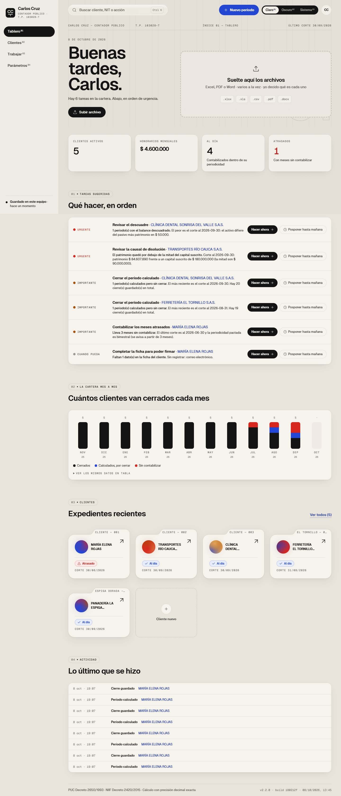
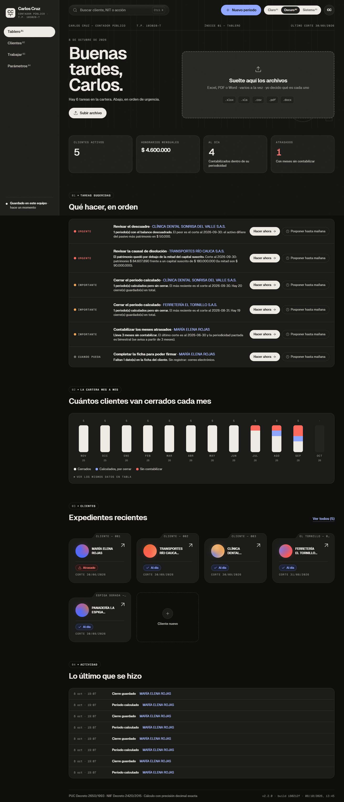
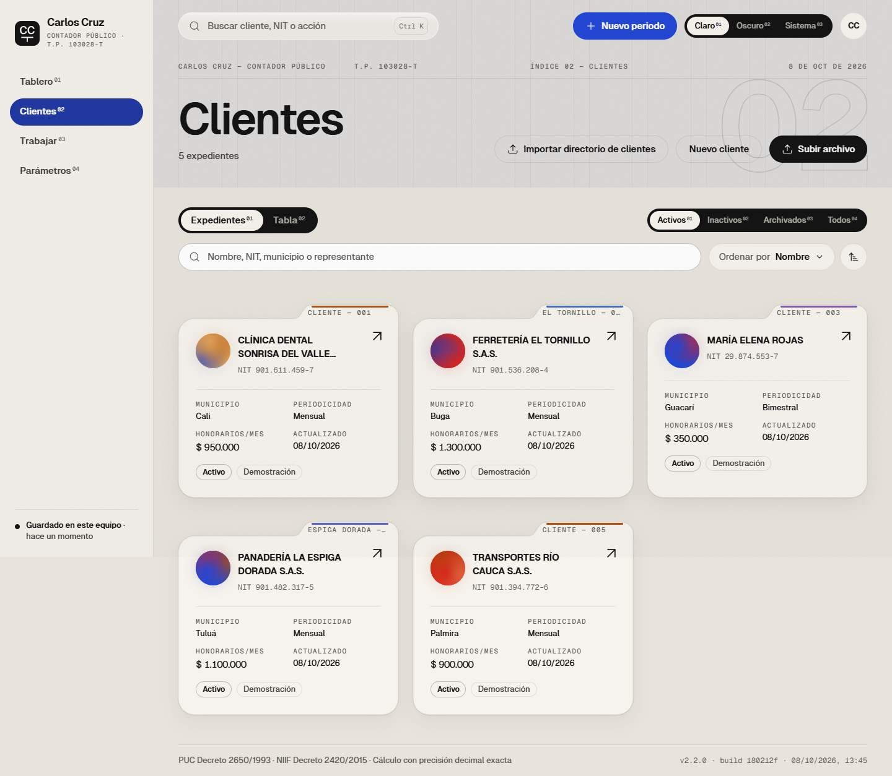
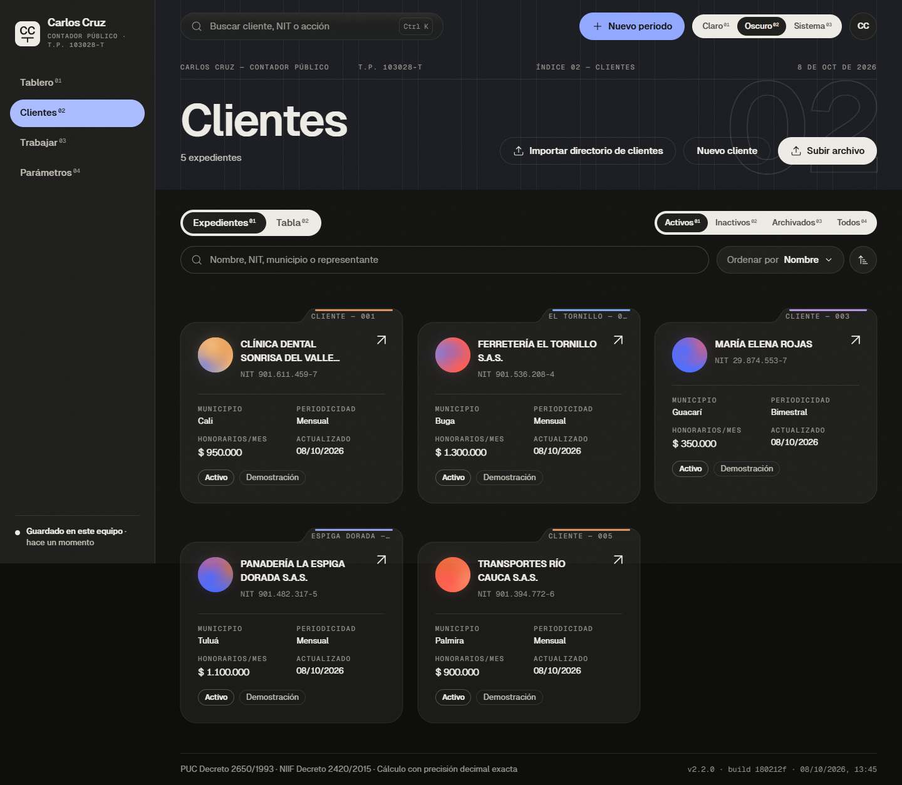
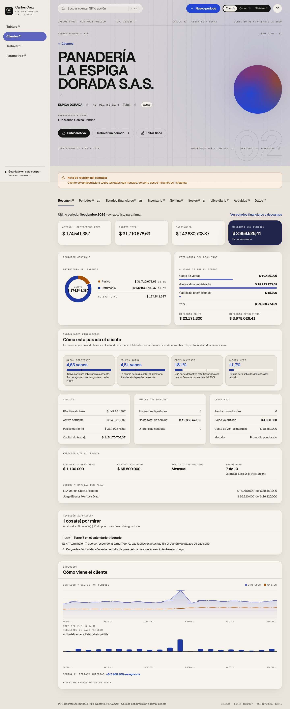
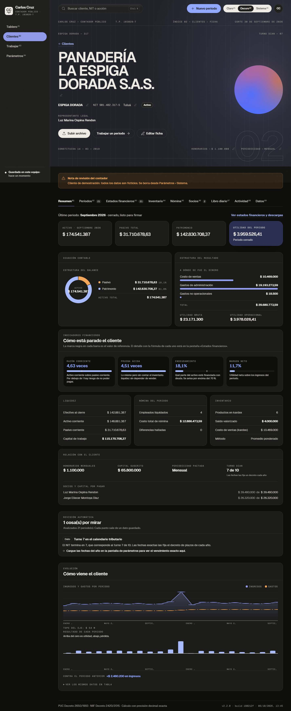
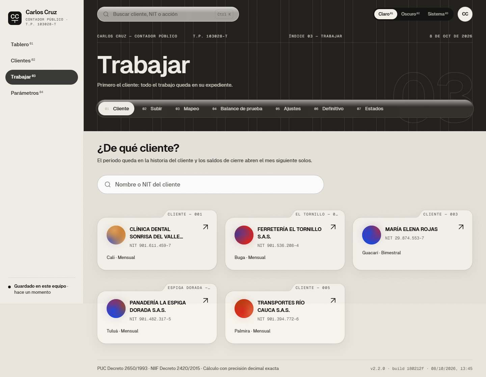
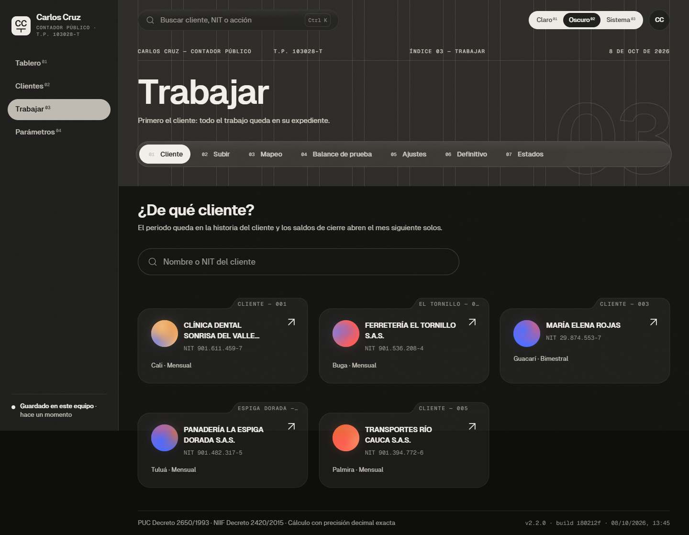
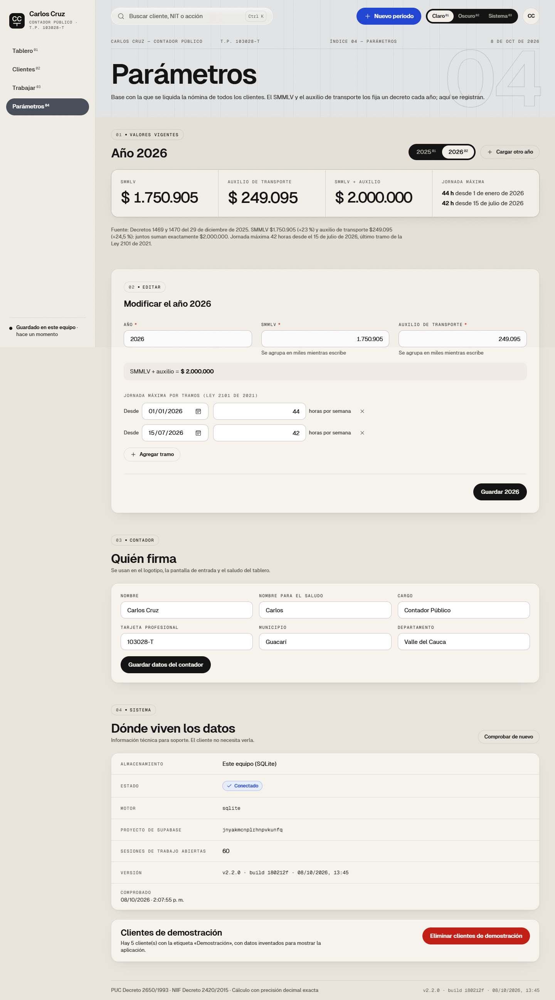
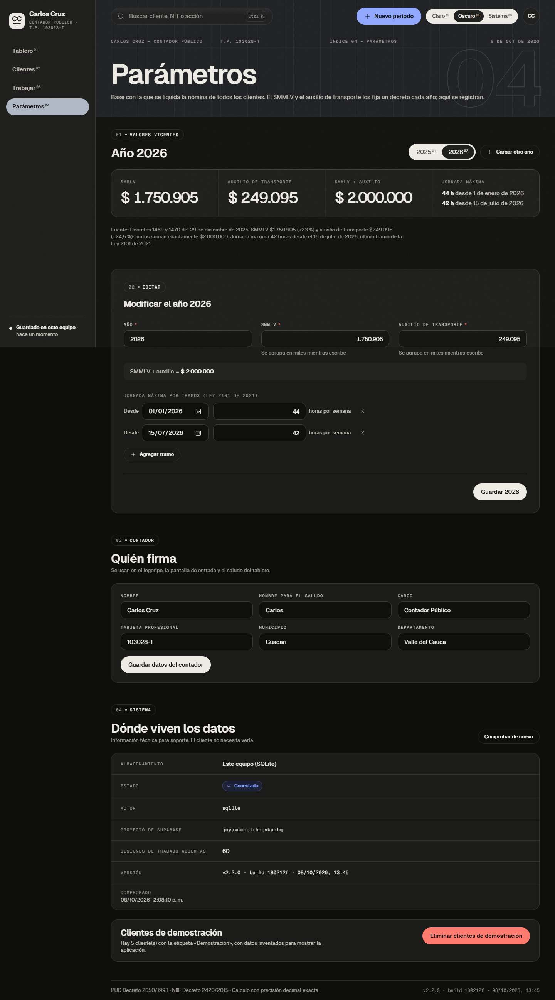

# Entrega v2.2.0 · Carlos Cruz — Contabilidad que cuadra

Fecha: 8 de octubre de 2026. Rama `main`, versión **2.2.0** (pie de página: `v2.2.0 · build …`).

## Qué cambió, por fase
| Fase | Qué | Informe |
|---|---|---|
| 1 | No se vuelven a perder datos: versiones de cada periodo, restaurar, archivo repetido avisado, cálculo vacío rechazado (H01, H08, H19) | [fase-1.md](fase-1.md) |
| 2 | FANANT enero 2025 recuperado centavo a centavo (H02) | [fase-2.md](fase-2.md) |
| 3 | Una sola puerta para subir lo que sea; ya no se asume FANANT (H03, H10) | [fase-3.md](fase-3.md) |
| 4 | Registros auxiliares desordenados → contabilidad, con preguntas; PDF y Word; libro diario suelto (P01); mes a mes; A1 | [fase-4.md](fase-4.md) |
| 5 | Libro diario oficial y libro mayor y balances en pantalla, Excel y PDF; todos los entregables desde cualquier archivo (H05–H07); A4 | [fase-5.md](fase-5.md) |
| 6 | Ficha llenada desde estatutos, RUT y cartas; formulario mínimo; edición en la ficha; A3, A6 | [fase-6.md](fase-6.md) |
| 7 | Tablero del contador: tareas en orden, indicadores, cartera mes a mes (H13, H18) | [fase-7.md](fase-7.md) |
| 8 | Tres planos, identidad por página, color por cliente, modo claro/oscuro/sistema | [fase-8.md](fase-8.md) |
| 9 | Cinco clientes históricos de demostración y su borrado en bloque | [fase-9.md](fase-9.md) |
| Secc. 2 y 3 | A5 (subidas en disco), H15, H17, H20, H22, H23 | [secciones-2-y-3.md](secciones-2-y-3.md) |
| 4.2 | Inicio de sesión del contador (A2) | abajo |
| 4.3 | Datos reales fuera de git | abajo y [../PRIVADO.md](../PRIVADO.md) |

## Capturas
**Después** (versionadas; tomadas en una copia con solo los clientes de demostración): `docs/v22/capturas/final/` — Tablero, Clientes, Ficha (resumen y estados), Trabajar y Parámetros, en claro y oscuro a 1440 px, y Tablero, Clientes y Ficha a 390 px.

| | Claro | Oscuro |
|---|---|---|
| Tablero |  |  |
| Clientes |  |  |
| Ficha |  |  |
| Trabajar |  |  |
| Parámetros |  |  |

**Antes** (v2.0, con datos de FANANT, por eso **no** están en el repositorio): `privado/capturas/diseno/capturas/fase-0/actual-0*.png` en el equipo del contador. Las capturas de cada fase también quedaron en `privado/capturas/`.

## Cifras de control
**FANANT enero 2025** (docs/v22/fase-2.md): recalculado desde los archivos reales en la copia aislada con las decisiones del cierre original — **13 saldos idénticos** y activo $ 37.144.505, pasivo $ 2.202.480,72, patrimonio $ 34.942.024,28, pérdida $ 2.857.975,72, ingresos $ 22.641. La prueba `test_cifras_de_control_fanant_enero_2025` lo repite en cada corrida. En la base real el periodo **no se recalculó**: se le agregó la nota A6.

**Banco de archivos variados** (`scripts/revisar_subidas.py`, cada uno por la puerta única, preguntas con la opción por defecto):

| Archivo | Resultado |
|---|---|
| 01 listas en bloques · 02 columnas mal rotuladas · 03 fechas copiadas y futuras · 11 libro diario CSV · 14 títulos mal escritos · 17 hoja por mes lado a lado | cuadra, **2 periodos** mes a mes |
| 04 totales mezclados · 05 hojas vacías · 06 cartera de terceros · 07 gastos CSV · 08 balance PDF · 08b ventas PDF · 09 ventas en Word · 12 inventario insuficiente · 13 datos repetidos · 15 inventario y conteo · 16 balance Excel · 18 listas sin tipo | cuadra, 1 periodo |
| 10 PDF escaneado | rechazado con mensaje claro (es una imagen: no tiene texto) |

Preguntas que hizo el sistema: 03 (2), 06 (2), 13 (2), 18 (2); los demás no necesitaron ninguna. Las cifras esperadas de cada archivo, calculadas a mano, están en `backend/tests/test_archivos_variados.py`.

**Clientes de demostración**: 91 periodos cargados por la API; todos cuadran salvo el descuadre intencional de $ 50.000 de la clínica (septiembre 2026).

## Verificación final (sección 4.1)
| Comprobación | Resultado |
|---|---|
| Pruebas del backend | ✅ **256** sin avisos (21 se saltan con aviso si `privado/` no está; con `privado/`, todas corren) |
| `tsc --noEmit` | ✅ |
| `npm run lint:diseno` | ✅ 0 infracciones |
| `npm run build` | ✅ |
| Pantallas (`frontend/scripts/revision-final.mjs`) | ✅ **392 vistas** (98 rutas: todas las páginas y las 9 pestañas de la ficha de 9 clientes, más editar, archivados y 404) en claro y oscuro, a 1440 y 390 px: sin errores de consola, sin desbordes, modo correcto |
| Botones | ✅ **995** botones, pestañas y enlaces pulsados (1440, claro) en todas las páginas y pestañas: **ninguno sin efecto**. Los que ya están elegidos (pestaña actual, mes seleccionado) se reconocen por su estado ARIA. No se pulsan en esta pasada los que borran, archivan, cierran, guardan o suben (Eliminar, Archivar, Reabrir, Guardar, Crear cliente, Posponer, Subir archivo, Cerrar sesión): los cubren los recorridos de sus fases (`flujo-fase5/6/7/9.mjs`, `flujo-sesion.mjs`), repetidos sin errores. `/diseno` es el catálogo de componentes: sus botones son muestras |
| Descargas | ✅ **63** descargas que ofrece la interfaz (Excel, PDF, libro diario, mayor y balances, saldos, plantillas): todas 200 con archivo |
| Subidas | ✅ banco (19), archivos reales de FANANT (6, uno por uno y juntos) y los 68 archivos de demostración |
| Ingreso | ✅ `frontend/scripts/flujo-sesion.mjs`: pantalla de ingreso en claro y oscuro, clave equivocada, sesión perdida a mitad de camino, cerrar sesión |
| Registro del servidor | ✅ sin errores |
| Código | Sin `console.log`, `print`, `TODO` ni código muerto: pyflakes limpio; se quitaron 8 funciones del backend y 6 exportaciones del frontend sin uso, y la plantilla oficial ya no dice «FANANT» en su título |
| Ejecutable (4.4) | ✅ reconstruido (`empaquetar/salida/CarlosCruz`, 102 MB); probado con un perfil vacío: arranca en v2.2.0, pide ingreso, sin errores |

## Inicio de sesión (4.2)
- Un usuario (el contador). En `backend/.env`: `CC_USUARIO`, `CC_CLAVE_HASH` (bcrypt) y `CLAVE_SESION`. Se crean o cambian con `python backend/crear_usuario.py` (pregunta usuario y contraseña; nunca guarda la contraseña).
- Cookie firmada (HMAC-SHA256), HttpOnly, SameSite=Lax, Secure si la conexión es HTTPS; dura 12 horas.
- Toda `/api/*` responde 401 sin sesión, salvo `/api/salud` y `/api/sesion`. 5 intentos fallidos en 15 minutos bloquean el ingreso (por equipo y por usuario); cada intento fallido queda en la bitácora.
- En el ejecutable, la primera vez la ventana negra pide crear usuario y contraseña; `CarlosCruz.exe --cambiar-clave` la cambia.
- **Limitación:** con el despliegue partido (interfaz en Vercel y API en otro dominio) la cookie SameSite=Lax no viaja. El uso previsto —`iniciar.bat` o el ejecutable, todo en un solo puerto— no tiene ese problema.

## Datos reales fuera de git (4.3) y el historial
Todo lo que tenía cédulas, NIT o documentos de clientes reales está ahora en `privado/` (ignorada). Detalle en [../PRIVADO.md](../PRIVADO.md). **El historial de git no se reescribió.**

**¿Conviene reescribirlo? Sí, si el repositorio estuvo o estará público.** Los commits anteriores contienen los archivos de FANANT, las cédulas de sus cuatro socios y de su contador, y capturas con esos datos; cualquiera que clone el repositorio los puede recuperar. Lo recomendado:
1. Hacer el repositorio **privado** en GitHub ya (Settings › General › Danger Zone › Change visibility).
2. Si se decide limpiar: `git filter-repo --path docs/fuentes --path docs/v22/respaldo-fanant-enero-2025.json --path data/empresa_fanant.json --path PROMPT.md --path docs/ANALISIS_FUENTES.md --path docs/diseno/capturas --path docs/v22/capturas --path docs/informe --invert-paths` y luego `git push --force` a `main`. Cambia todos los identificadores de commit: cualquier otra copia del repositorio tendría que clonarse de nuevo. Hacerlo después de hacerlo privado y con una copia de respaldo.

## Formatos: «subo un archivo y calcula todo»
| Formato | ¿Calcula todos los entregables? |
|---|---|
| Excel (.xlsx, .xls, .csv) | **Sí**: plantilla oficial, registros auxiliares desordenados, libro diario, balance de prueba, cuenta T, hoja de trabajo, nómina y aportes |
| PDF | **Sí, si tiene texto** (exportado de un programa): balances y tablas de ventas. **No** si es escaneado (una foto): se rechaza con un mensaje que lo dice |
| Word (.docx) | **Sí** para tablas de ventas/compras/gastos; los estatutos, RUT y cartas llenan la ficha del cliente |

## Pendientes y limitaciones conocidas
- PDF escaneado: no hay lectura de imágenes (OCR).
- A6 · FANANT enero 2025: la nota quedó escrita en la ficha y en el periodo; **decidir con Carlos Cruz** qué se hace con las diferencias (hoja de trabajo de 2012, capital 37,8 M vs 30 M, posible doble registro de $300.000).
- El ejecutable no lleva firma digital: Windows advierte la primera vez (explicado en LEAME.txt).
- Prima y cesantías en los clientes de demostración se pagan con el saldo del cierre anterior (simplificación de los datos de ejemplo, no de la aplicación).
